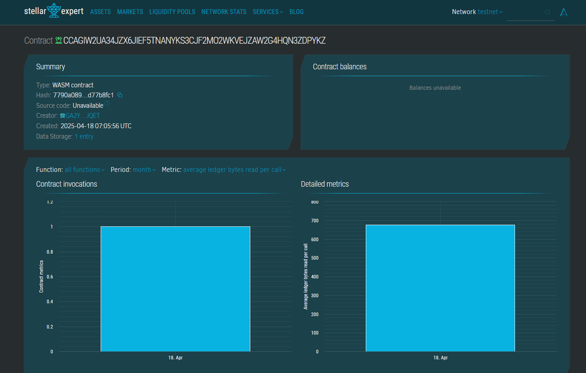

# NFT Staking for Rewards

## 📄 Project Description

This project allows users to stake their NFTs to earn time-based rewards on a decentralized application (dApp) built on the Soroban smart contract platform. Users can stake NFTs, earn rewards based on staking duration, and view their accumulated reward points.

## 🎯 Project Vision

To incentivize NFT holders by allowing them to earn passive rewards through a secure, transparent, and decentralized staking mechanism using Stellar's smart contract platform—Soroban. Our goal is to transform NFTs from static assets into yield-generating assets.

## 🚀 Key Features

- **NFT Staking**: Users can stake their NFTs with a single transaction.
- **Unstaking with Rewards**: Reward points are calculated based on how long the NFT was staked.
- **Reward Tracking**: Users can query and track their total rewards anytime.
- **Efficient and Secure**: Built using the Soroban SDK, ensuring optimized performance and trustless execution.

## 🔮 Future Scope

- **NFT Metadata Integration**: Fetch and display metadata tied to NFTs.
- **Reward Redemption**: Enable users to convert reward points into tokens or exclusive NFTs.
- **Leaderboard System**: Introduce community-driven gamification for top stakers.
- **Multi-Token Support**: Stake different types of NFTs or tokens for varied reward types.
- **UI Dashboard**: Develop a user-friendly front-end for interaction with the smart contract.

---

**Tech Stack**: Soroban SDK (Rust), Stellar Blockchain

**License**: MIT

## Contract Details
CCAGIW2UA34JZX6JIEF5TNANYKS3CJF2MO2WKVEJZAW2G4HQN3ZDPYKZ

.
